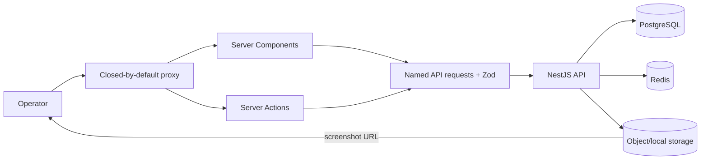

# Operations Console Architecture

## System boundary

The console is a Next.js server application with no database, queue, cache, or storage of its own.
It holds an encrypted operator session and calls the Dwelve NestJS API server-side. Report screenshot
URLs are the only data resources fetched directly by the browser.



## Layers and ownership

| Layer                        | Location                                                               | Responsibility                                                                               |
| ---------------------------- | ---------------------------------------------------------------------- | -------------------------------------------------------------------------------------------- |
| Route/security edge          | `src/proxy.ts`, `next.config.ts`                                       | Closed route guard, proactive refresh, CSP nonce, private/no-store, security/noindex headers |
| Routes and Server Components | `src/app/(console)`, `src/app/login`                                   | Query parsing, server reads, page composition                                                |
| Server Actions               | `src/lib/auth/actions.ts`, `platform/actions.ts`, `reports/actions.ts` | Validate operator intent, call API, map safe errors, redirect/revalidate                     |
| Transport                    | `src/lib/api/backend.ts`, `src/lib/auth/backend.ts`                    | Server-only base URL, timeout, request ID, bearer header, refresh, Zod validation            |
| Domain contracts             | `src/lib/platform`, `src/lib/reports`                                  | Named endpoints, query types, schemas, and domain guards                                     |
| Console components           | `src/components/console`                                               | Command/navigation rail, palette, filters, shared page furniture                             |
| Design primitives            | `src/components/ui`, `src/app/globals.css`                             | Panel vocabulary, disposition marks, tokens, aurora, charts, theme, interaction              |

## Route map

| Route                 | Access             | Purpose                                                   | Main implementation                             |
| --------------------- | ------------------ | --------------------------------------------------------- | ----------------------------------------------- |
| `/`                   | `SUPER_ADMIN`      | Platform overview and charts                              | `src/app/(console)/page.tsx`                    |
| `/users`              | `SUPER_ADMIN`      | Cross-platform user search/filter/access                  | `src/app/(console)/users/page.tsx`              |
| `/users/[userId]`     | `SUPER_ADMIN`      | User memberships, access, one-time credential             | `src/app/(console)/users/[userId]/page.tsx`     |
| `/schools`            | `SUPER_ADMIN`      | School search/status directory                            | `src/app/(console)/schools/page.tsx`            |
| `/schools/[schoolId]` | `SUPER_ADMIN`      | School footprint, members, deactivation                   | `src/app/(console)/schools/[schoolId]/page.tsx` |
| `/reports`            | `SUPER_ADMIN`      | Filterable report docket                                  | `src/app/(console)/reports/page.tsx`            |
| `/reports/[reportId]` | `SUPER_ADMIN`      | Evidence and disposition workflow                         | `src/app/(console)/reports/[reportId]/page.tsx` |
| `/students`           | `SUPER_ADMIN`      | Permanent compatibility redirect to `/users?role=STUDENT` | `src/app/(console)/students/page.tsx`           |
| `/login`              | Public, auth-aware | Operator sign-in                                          | `src/app/login/page.tsx`                        |
| `/session/end`        | Always reachable   | Clear stale/revoked operator cookie and return to login   | `src/app/session/end/route.ts`                  |

The proxy is the first lock and `src/app/(console)/layout.tsx` refuses to paint a shell without a
session. Every backend endpoint independently re-reads global role/authorization; cookie role is not
the final security decision.

## Request and state flow

```text
Server Component or Server Action
-> named platform/report request
-> authedBackendJson
-> backendJson (15s default timeout, no-store, X-Request-Id)
-> NestJS API
-> Zod-validated response
```

The query string owns overview range, filters, search, and pagination, allowing operator links to be
shared. Common access, school-status, and school-role switches are real links rather than local tab
state. The encrypted `dwelve_ops` cookie owns identity and API tokens. There is no client data cache
or global state library. Theme lives in `localStorage["dwelve-ops-theme"]` and is applied before paint
by the nonce-bearing inline script.

## Failure behavior

- Expected action failures are mapped to safe operator-facing messages.
- Backend responses that do not match Zod fail closed with `BackendResponseValidationError`.
- A render-time `401` cannot spend a single-use refresh token if the replacement cookie cannot be
  saved; the proxy refreshes on the next navigation.
- A `403` is not retried as authentication because it can mean the operator role was revoked.
- Aurora count failure degrades to zero so the shell remains usable; textual API panels still expose
  the platform failure.
- Relative local-storage media URLs are rebased to the API origin by `resolveMediaUrl`.

## UI boundary

The complete design contract is [`../../DESIGN.md`](../../DESIGN.md). At desktop widths a fixed 248px
sidebar owns global routes, queue state, search, theme, and sign-out; at narrow widths it becomes a
top utility bar and four-destination bottom dock. Content caps at 1520px and pages scroll normally.
The fixed background carries only a faint topology grid and a restrained open-report trace; route
content sits on opaque surfaces rather than translucent glass. Dark is the default character and
light is a maintained second character. Evidence stays on `.plate-daylight` in both themes.

The command palette performs no browser-side record lookup. A pasted UUID offers report, user, and
school routes because UUID shape does not identify its domain; the selected server route and backend
authorization decide whether that record exists and may be read.
